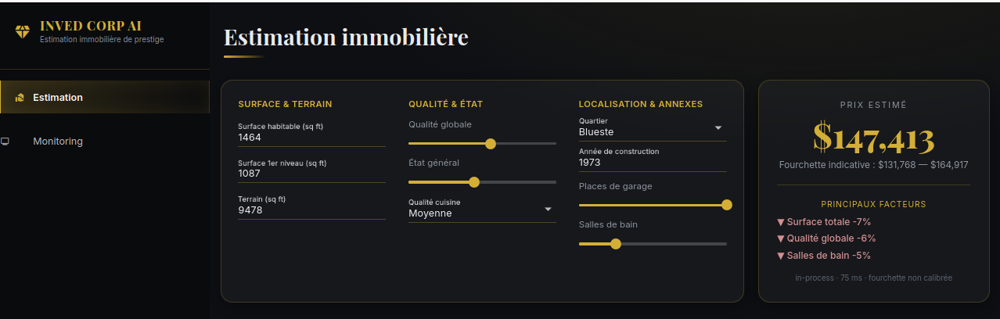
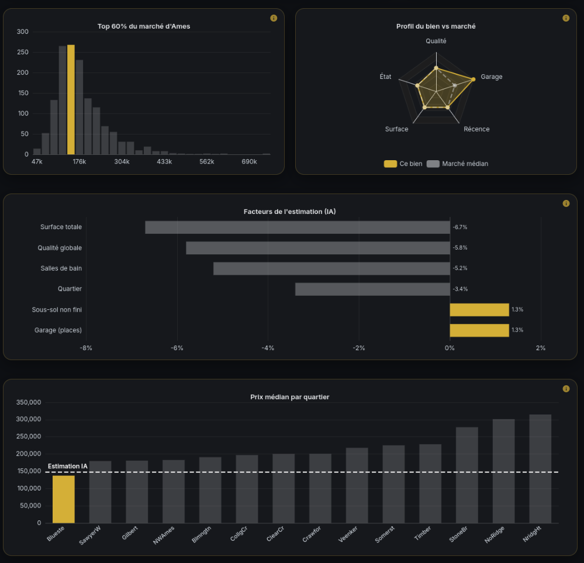
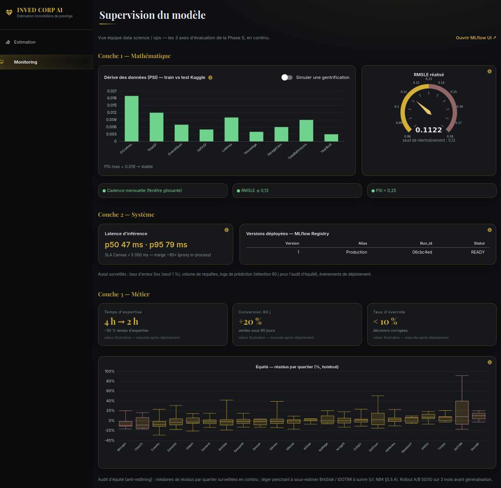

# Inved Corp — Estimation de prix immobiliers

> **HES-SO ARC —  Science des données (64-61.1)** · Équipe : Noé Berdoz, Cyrille Dos Ghali, Steeve Leuba.

Projet mené sous la forme d'un **roleplay** : une société de conseil immobilier fictive, **Inved Corp**, veut un **outil assistif d'estimation** pour ses consultants. Le livrable suit la méthodologie **CRISP-ML(Q)** de bout en bout, du besoin métier jusqu'à une application de démonstration et au plan de surveillance en production.

- **Tâche** : régression supervisée — prédire le **prix de vente** (`SalePrice`, USD) d'un bien résidentiel à partir de **79 caractéristiques**.
- **Données** : Kaggle *« House Prices — Advanced Regression Techniques »* (Ames, Iowa), dans `data/`.
- **Métrique** : **RMSLE** (RMSE sur `log1p(SalePrice)`) — l'erreur immobilière se mesure en **relatif**, pas en dollars absolus (un écart de 10 k$ ne pèse pas pareil sur une maison à 100 k$ et sur une villa à 1 M$).
- **Décision outillée** : sur soumission d'un formulaire, l'outil renvoie un **prix estimé + intervalle + top-3 facteurs explicatifs**, le consultant gardant la validation finale. Deux usages : **conseil rénovation** (quand l'IA < attente client, on montre les leviers) et label **« Prix certifié par Inved AI »** (quand IA ≈ marché).

> Synthèse produit complète : `docs/MLCanvas_v1.2.pdf` (ML Canvas OWNML rempli).

---

## Méthodologie — CRISP-ML(Q)

Le projet suit la méthodologie **CRISP-ML(Q)** (*Cross-Industry Standard Process for Machine Learning with Quality assurance*), conçue pour les projets de machine learning : elle structure le travail en phases de la compréhension métier jusqu'à la **surveillance & maintenance** du modèle en production (§7), avec des **exigences de qualité explicites à chaque phase**.

Convention de numérotation : **`§N = numéro de phase`**. Le préfixe de fichier (`1_`, `2_`, `3a`…) indique l'**ordre de lecture**.

| Phase CRISP-ML | Intitulé | Où |
|--------------:|----------|----|
|             1 | Compréhension métier | `1_ideation_phase` (§1) |
|             2 | Compréhension des données (EDA) | `1_ideation_phase` (§2) |
|             3 | Préparation des données | `2_data_prep` (§3) |
|             4 | Modélisation | `3a` / `3b` / `3c` / `3d` (§4.1–4.4) |
|             5 | Évaluation | `4_evaluation` (§5) |
|             6 | Déploiement | `5_deployment` (§6) |
|             7 | Surveillance & maintenance *(extension Q)* | `6_monitoring` (§7) |
|             — | Conclusion | `7_conclusion` |
---

## Structure du projet (10 notebooks)

| Notebook | Chapitre | Rôle |
|----------|----------|------|
| `1_ideation_phase.ipynb` | §1 + §2  | Business understanding (ML Canvas) + EDA commentée (Shapiro-Wilk, ANOVA, cardinalité, justification RMSLE) |
| `2_data_prep.ipynb` | §3       | Préparation **canonique** : feature engineering, anti-fuite (imputation dans le Pipeline), encodage hybride (Ordinal / TargetEncoder / OHE), **3 préprocesseurs** (`_scaled` / `_encoded` / `_native`) + helpers partagés |
| `3a_scaled_models.ipynb` | §4.1     | Linéaires + KNN + MLP (OLS, Ridge, Lasso, ElasticNet, SVR, KNN, MLP) — chemins de régularisation, diagnostics OLS |
| `3b_sklearn_trees.ipynb` | §4.2     | Arbres sklearn (DecisionTree, RandomForest, GradientBoosting, AdaBoost) |
| `3c_native_boosting.ipynb` | §4.3     | Boosting moderne (XGBoost natif vs OneHot + Optuna, LightGBM, CatBoost) + **SHAP** |
| `3d_stacking.ipynb` | §4.4     | **Stacking** à préparations mixtes (Lasso + GradientBoosting + XGBoost → méta-RidgeCV) |
| `4_evaluation.ipynb` | §5       | Comparaison inter-familles, dissertation 3 axes (math/système/métier), IC bootstrap, équité OOF → désignation du **champion** |
| `5_deployment.ipynb` | §6       | Réentraînement sur 100 % des données, **soumission Kaggle**, **registre + service MLflow**, stratégie de déploiement, coût, scaffold PoC |
| `6_monitoring.ipynb` | §7       | Monitoring **3 couches** + traçabilité MLflow des 17 modèles + dérive PSI + réentraînement + équité continue |
| `7_conclusion.ipynb` | —        | Synthèse exécutive (rapport à la direction) : récap CRISP-ML(Q), champion, risques, perspectives |

> **Ordre d'exécution.** `2_data_prep.ipynb` est la **source unique** de la préparation : chaque notebook de modélisation/évaluation/monitoring le ré-exécute via `%run 2_data_prep.ipynb` en première cellule (rien à lancer à la main, mais il doit rester exécutable). `4_evaluation` lit les `results/family_*.json` produits par `3a`–`3d` ; `5_deployment` lit `results/winning_model.json` produit par `4_evaluation`.
>
> *Archives (TODO: à supprimmer) : `old_2_Design_phase.ipynb`, `old_3_Assessment_Blueprint.ipynb` (originaux pré-découpage) et `predicting-houses-prices-ml.ipynb` (mono-notebook historique).*

---

## Résultats clés

- **Champion : Stacking** (Lasso + GradientBoosting + XGBoost → méta-RidgeCV).
- **RMSLE holdout = 0,1122** (OOF 0,1108 ; IC95 bootstrap ≈ [0,096–0,130]). Le top ~13 modèles est en **quasi ex-æquo statistique** (IC chevauchants) ; la **diversité d'erreurs** du Stacking fait la différence. Repli légitime : CatBoost / XGBoost tuné (Δ ≈ 0,005, ¼ de la surface de monitoring).
- **Critère de déploiement** : RMSLE ≤ **0,13** (franchi confortablement).
- **MLflow** : le champion est enregistré dans le Model Registry sous l'alias **`inved-house-price@Production`** ; l'expérience contient le champion + les 17 modèles candidats.
  ```bash
  # mlruns/ n'est pas versionné (chemins absolus locaux non portables)
  jupyter nbconvert --to notebook --execute 5_deployment.ipynb 6_monitoring.ipynb
  mlflow ui --backend-store-uri file:./mlruns -p 5001     # explorer runs + registre
  ```

---

## Application PoC — « Inved Corp AI »

Démonstrateur web (**bonus**, hors périmètre noté) qui sert le champion derrière une interface moderne. Construit en **NiceGUI** (Python), thème sombre + or « prestige ». **Deux audiences, deux pages.**

### Page « Estimation » — le consultant

Le consultant renseigne les caractéristiques du bien ; l'estimation se met à jour **en temps réel** (prix animé), avec une fourchette indicative et les **3 principaux facteurs** (SHAP).



Quatre graphiques (animés, ECharts) contextualisent l'estimation, chacun avec une icône **(i)** d'aide au survol :



- **Position sur le marché** — où se situe l'estimation dans la distribution des prix d'Ames (percentile).
- **Profil du bien vs marché** — radar des caractéristiques clés en percentiles.
- **Facteurs de l'estimation (SHAP)** — contribution de chaque variable, en % d'effet sur le prix.
- **Comparables par quartier** — prix médian par quartier, avec votre estimation repérée.

### Page « Supervision du modèle » — l'équipe data science / ops

Le monitoring **3 couches** (= les 3 axes d'évaluation de la Phase 5, projetés en continu sur la production), chaque encart documenté par une info-bulle :



- **Couche mathématique** — dérive **PSI** (train vs données entrantes) + **simulateur « gentrification »** (déclenche l'alerte en direct) + jauge **RMSLE vs seuil 0,13**.
- **Couche système** — latence vs SLA (< 5 s) + **table réelle du registre MLflow** (versions, alias `@Production`).
- **Couche métier** — KPIs du Canvas (*valeurs illustratives*) + **audit d'équité réel** (résidus par quartier, anti-redlining).

### Lancer le PoC

Depuis la racine du dépôt, avec le `.venv` du projet activé :

```bash
python app/app.py            # -> http://localhost:8502
```

Le modèle est chargé via MLflow ; deux chemins d'inférence (détection automatique, indiqué dans la barre latérale) :

1. **API MLflow** (chemin canonique) — si un serveur tourne :
   ```bash
   mlflow models serve --model-uri "models:/inved-house-price@Production" -p 5000 --env-manager local
   ```
2. **En mémoire** (repli automatique) — sinon, le champion est chargé en process (aucune action requise).

> Détails techniques : `app/features.py` (`build_row` — format à 87 colonnes), `app/api_client.py` (clients d'inférence REST + en mémoire), générateurs `app/_generate_defaults.py` et `app/_gen_monitoring.py`. SHAP approximé via le membre XGBoost du Stacking (additivité vérifiée). Démo locale, sans authentification.

---

## Installation de l'environnement

Python **3.13** requis (versions pinnées dans `requirements.txt`).

```bash
# 1. Virtual env (depuis la racine du repo)
python3.13 -m venv .venv
source .venv/bin/activate            # Linux / macOS
# .venv\Scripts\activate             # Windows (PowerShell / cmd)

# 2. Dépendances (modélisation + MLflow + app NiceGUI)
pip install --upgrade pip
pip install -r requirements.txt
pip install -r requirements-dev.txt  # outils Jupyter (dev)

# 3. Kernel Jupyter
python -m ipykernel install --user --name inved-corp \
    --display-name "Python (Inved Corp .venv)"
```

Dans Jupyter / PyCharm, sélectionner le kernel **« Python (Inved Corp .venv) »**.

## Lancer Jupyter

```bash
source .venv/bin/activate            # Windows : .venv\Scripts\activate
jupyter lab                          # ou : jupyter notebook
```

## Données

`data/` contient les CSV Kaggle d'origine (`train.csv`, `test.csv`, `sample_submission.csv`, `data_description.txt`), versionnés dans le repo.

## Soumission Kaggle

`5_deployment.ipynb` (§6.2) réentraîne le champion sur 100 % des données et produit `submission.csv` à la racine (git-ignoré) — à uploader manuellement sur Kaggle.
